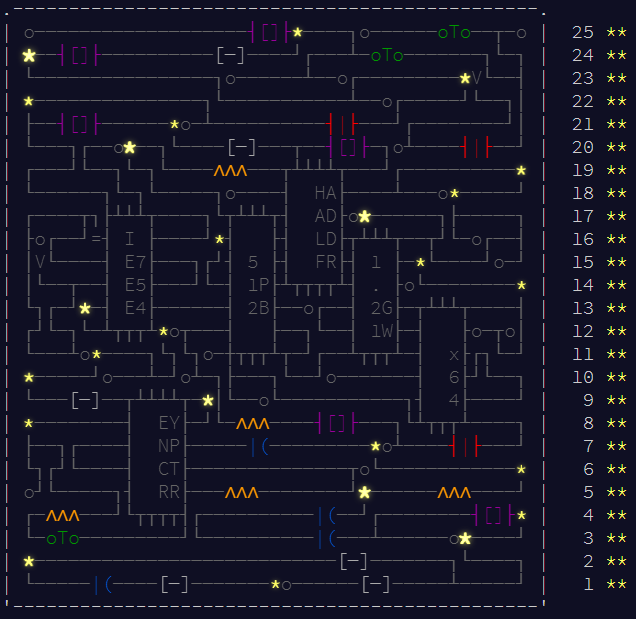

# Advent of Code 2017 - Complete Edition

This repository contains all my solutions to [Advent of Code 2017](https://adventofcode.com/2017).

## The solutions

See the [journal](journal.md) for descriptions of the solutions.

As a rule, the programs read the input from stdin. If the input is just a number, then it might be taken as a command-line argument.

I've been using three languages, occasionally in combination with some standard GNU tools. The languages are:

* Clojure
* Python 2.7
* Perl 5

I also made no attempt to reuse code from part 1 in part 2 in any nice way. I treated part 1 and part 2 as different code bases with no possibility to share code, so many problems have a lot of code in common. The reason is simple: I wanted each solution to be standalone and all code visible on the screen at the same time.

## Running all solutions

You can test run all of the solutions using `run-all.sh`. The Clojure solutions seem slow, but that is more often than not due to the infamous start-up cost, and not the main function being slow.

The requirements are

* Python 2.7
* Perl 5.10 or later
* [leiningen](https://leiningen.org/) 2

If you really feel like it, you can save your own puzzle input (using Unix line endings) in the input directory and run through all solutions, with exception of day 23 part 2, and possibly day 7 part 2. (Obviously you should not do this just to get 50 stars!)

If you find that my solution does not generate the correct answer for your input (and is not listed as an exception above), please open an issue!

## Copyright and license

Copyright © 2018-2019 Johan Lodin

Distributed under CC BY-SA 4.0.

All code in this repository is distributed by both CC BY-SA 4.0 and GNU AGPLv3.
